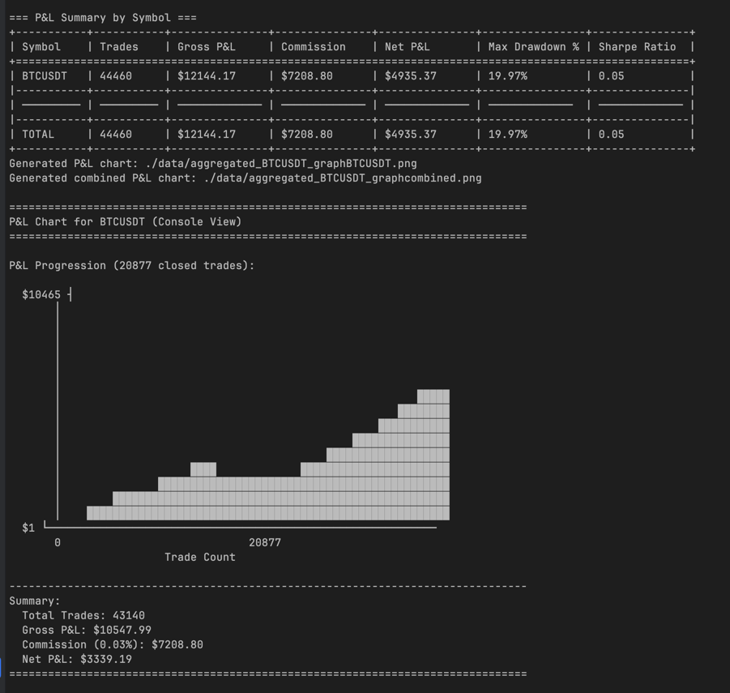

# HappyTest

> High-performance framework for HFT data acquisition, analysis, and backtesting



## What is HappyTest?

HappyTest is a Rust-based framework designed for high-frequency trading research. It provides fast, memory-efficient tools for processing orderbook data, implementing trading strategies, and analyzing performance metrics at microsecond precision.

### Core Capabilities

- **Data Processing**: Stream JSONL/Parquet orderbook snapshots with minimal memory footprint
- **Strategy Testing**: Modular architecture for market making, arbitrage, and custom algorithms  
- **Performance Analysis**: Real-time PnL tracking, position management, and risk metrics
- **Production Ready**: Sub-second processing of 12,000+ orderbook messages

## Architecture

```
happytest/
├── core/           # Models, trade state, execution engine
├── data/           # JSONL/Parquet readers, orderbook parsing
├── strategy/       # Market maker, arbitrage implementations
├── backtest/       # Performance analytics, metrics collection
└── trading/        # Order management, position tracking
```

### Key Modules

**`core`** - Trade models, orderbook structures, state management  
**`data`** - High-performance parsers for market data formats  
**`strategy`** - Trait-based strategy interface with GPT market maker  
**`backtest`** - Dashboard for PnL, Sharpe ratio, max drawdown  
**`trading`** - Position tracking, order execution simulation

## Quick Start

```bash
# Build optimized binary
cargo build --release

# Run GPT market maker on sample data (with regex pattern)
cargo run --release --bin happytest -- --directory ./data --file "BTCUSDT_202509.*\.jsonl" gpt

# Custom parameters
cargo run --release -- \
  --directory ./data \
  --file orderbook.jsonl \
  --fill-rate 0.95 \
  --slippage-bps 1.0 \
  gpt \
  --fix-order-volume 0.01 \
  --take-profit-bps 30
```

## Performance

Benchmarked on commodity hardware:
- **Throughput**: 12,000 orderbook updates/second
- **Latency**: <100μs per strategy tick
- **Memory**: <50MB for 1M orderbook snapshots

## Installation

### Requirements
- Rust 1.60+
- 4GB RAM
- x86_64 or ARM64 processor

### Cross-compilation

```bash
# Apple Silicon
rustup target add aarch64-apple-darwin
cargo build --release --target aarch64-apple-darwin

# Linux x86_64
rustup target add x86_64-unknown-linux-gnu
cargo build --release --target x86_64-unknown-linux-gnu

# Static binary (Alpine)
rustup target add x86_64-unknown-linux-musl
cargo build --release --target x86_64-unknown-linux-musl
```

### CPU Optimization

```bash
# Native CPU features
RUSTFLAGS="-C target-cpu=native" cargo build --release

# Intel Skylake+
RUSTFLAGS="-C target-cpu=skylake" cargo build --release

# Apple M1/M2
RUSTFLAGS="-C target-cpu=apple-m1" cargo build --release
```

## Usage Examples

### Basic Backtest
```bash
cargo run --release -- --directory ./data --file ETHUSDT.jsonl gpt
```

### With Logging
```bash
RUST_LOG=info cargo run --release -- --directory ./data --file BTC.parquet gpt
```

### Custom Strategy Parameters
```bash
cargo run --release -- gpt --help  # View all options
```

## API Example

```rust
use happytest::{
    strategy::GPTMarketMaker,
    backtest::Backtester,
    data::JSONLReader,
};

let reader = JSONLReader::new("data/orderbook.jsonl")?;
let strategy = GPTMarketMaker::default();
let mut backtester = Backtester::new(reader, strategy);

backtester.run()?;
backtester.print_dashboard();
```

## Contributing

HappyTest is designed for extensibility:

1. **New Strategies**: Implement `Strategy` trait in `src/strategy/`
2. **Data Formats**: Add readers in `src/data/` 
3. **Metrics**: Extend `TradeDashboard` in `src/backtest/`

## License

MIT