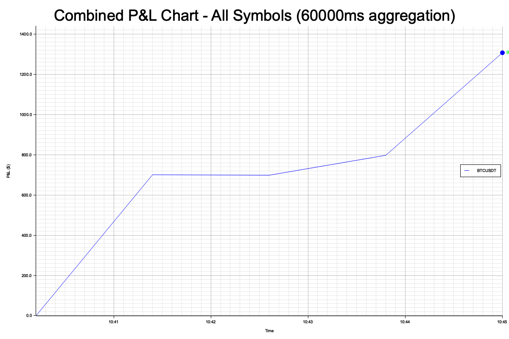

# HappyTest

> High-performance framework for HFT data acquisition, analysis, and backtesting



## What is HappyTest?

HappyTest is a Rust-based framework designed for high-frequency trading research. It provides fast, memory-efficient tools for processing orderbook data, implementing trading strategies, and analyzing performance metrics at microsecond precision.

### Core Capabilities

- **Data Processing**: Stream JSONL/Parquet orderbook snapshots with minimal memory footprint
- **Strategy Testing**: Modular architecture for market making, arbitrage, and custom algorithms  
- **Performance Analysis**: Real-time PnL tracking, position management, and risk metrics
- **Production Ready**: Sub-second processing of 12,000+ orderbook messages

## Architecture

```
src/
├── core/               # Fundamental types: Trade, OrderBook, TradeState, PnLResult
├── domain/             # Business logic layer
│   ├── indicator/      # Reusable indicators: Vwap, VolatilityDetector, MomentumDetector
│   └── model/          # Unified domain models: Position, Side
├── strategy/           # Trading strategies (GPT market maker)
├── backtest/           # Backtesting framework
│   ├── engine.rs       # BacktestEngine orchestration
│   ├── trade_dashboard.rs  # TradeDashboard analytics
│   └── executor.rs     # TradeEmitter execution simulation
├── analytics/          # Analysis and reporting
│   ├── pnl/            # P&L calculation (FIFO/Position methods)
│   └── metrics.rs      # Trading metrics: Sharpe ratio, drawdown, win rate
├── exchange/           # Exchange connectivity
│   ├── bybit/          # Bybit WebSocket reader, models
│   └── connector.rs    # ExchangeConnector trait
├── storage/            # Data storage abstraction
│   ├── source/         # Data reading: FileDataSource, ParquetDataSource
│   └── sink/           # Data writing: JsonlWriter, ParquetWriter
├── reader/             # Reader binary support, data models
├── config/             # Configuration defaults and validation
└── utils/              # (Deprecated) Legacy data loaders
```

### Key Modules

**`core`** - Trade models, orderbook structures, state management
**`domain`** - Technical indicators (VWAP, volatility, momentum) and position models
**`strategy`** - Trait-based strategy interface with GPT market maker
**`backtest`** - Engine, dashboard, and trade execution simulation
**`analytics`** - P&L calculation and trading metrics (Sharpe, drawdown)
**`exchange`** - Exchange connectivity with Bybit WebSocket support
**`storage`** - Unified data I/O for JSONL and Parquet formats

## Quick Start

```bash
# Build optimized binary
cargo build --release

# Run GPT market maker on sample data
cargo run --release -- --file data/BTCUSDT.parquet gpt

# Custom parameters
cargo run --release -- \
  --file data/orderbook.jsonl \
  --fill-rate 0.95 \
  --slippage-bps 1.0 \
  gpt \
  --fix-order-volume 0.01 \
  --take-profit-bps 30
```

## Performance

Benchmarked on commodity hardware:
- **Throughput**: 12,000 orderbook updates/second
- **Latency**: <100μs per strategy tick
- **Memory**: <50MB for 1M orderbook snapshots

## Installation

### Requirements
- Rust 1.60+
- 4GB RAM
- x86_64 or ARM64 processor

### Cross-compilation

```bash
# Apple Silicon
rustup target add aarch64-apple-darwin
cargo build --release --target aarch64-apple-darwin

# Linux x86_64
rustup target add x86_64-unknown-linux-gnu
cargo build --release --target x86_64-unknown-linux-gnu

# Static binary (Alpine)
rustup target add x86_64-unknown-linux-musl
cargo build --release --target x86_64-unknown-linux-musl
```

### CPU Optimization

```bash
# Native CPU features
RUSTFLAGS="-C target-cpu=native" cargo build --release

# Intel Skylake+
RUSTFLAGS="-C target-cpu=skylake" cargo build --release

# Apple M1/M2
RUSTFLAGS="-C target-cpu=apple-m1" cargo build --release
```

## Usage Examples

### Basic Backtest
```bash
cargo run --release -- --file data/ETHUSDT.jsonl gpt
```

### With Logging
```bash
RUST_LOG=info cargo run --release -- --file data/BTC.parquet gpt
```

### Custom Strategy Parameters
```bash
cargo run --release -- gpt --help  # View all options
```

## API Example

```rust
use happytest::{
    strategy::GPTMarketMaker,
    backtest::Backtester,
    data::JSONLReader,
};

let reader = JSONLReader::new("data/orderbook.jsonl")?;
let strategy = GPTMarketMaker::default();
let mut backtester = Backtester::new(reader, strategy);

backtester.run()?;
backtester.print_dashboard();
```

## Contributing

HappyTest is designed for extensibility:

1. **New Strategies**: Implement `Strategy` trait in `src/strategy/`
2. **Data Formats**: Add readers in `src/data/` 
3. **Metrics**: Extend `TradeDashboard` in `src/backtest/`

## License

MIT